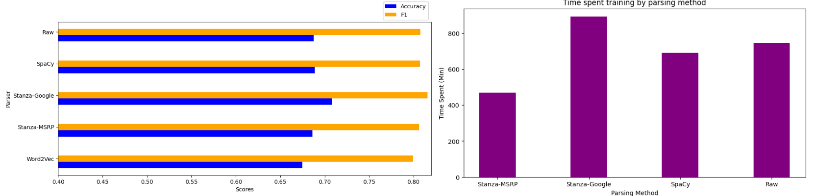

# CS598 Deep Learning for Healthcare Project

__Team 186__

| Name               | Email                        |
| ------------------ | ---------------------------- |
| Adam Michalsky     | adamwm3@illinois.edu         |
 | Michael Pettatano  | mp34@illinois.edu           |


This repository is an implementation of [CS598 Deep Learning for Healthcare Reproducibility Project](./deliverables/Team_186_CS598DL4H_Project_FINAL_SP23.pdf) which is our attempt at reproducing the experiments conducted in
[Disease Prediction and Early Intervention System Based on Symptom Similarity Analysis](https://ieeexplore.ieee.org/document/8924757).


Our approach mirrored the original paper's approach for the most part. It is broken out into 3 seperate stages:

1) **Data Pre-Processing** - Here we will read in the raw data, parse it using the described algorithm, and prepare the parsed data by performing embedding using `Word2Vec`.

2) **Neural Network** - Here we build the CNN-based model described in the original paper. This CNN will take the vectorized sentences pairs as inputs and return a similarity assesment [0,1].  No specifics of network architecture were offered in the original paper so the architecture is based on the our own knowledge.

3) **Training & Validation** - Here we train and test the model using the data and network established in the previous stages.

<div>
    <figure>
        
    </figure>
</div>

Detailed explanations behind the model architecture, data processing and functions used, please refer to the [reproduction whitepaper](./deliverables/Team_186_CS598DL4H_Project_FINAL_SP23.pdf) or [presentation](www.youtube.com).

In order to validate some of the claims from the original paper, we introduced several ablations which resulted in different model variants. Below are the names and explanations.

- `Stanza-MSRP`: Model that leverages a stanza parser and a `Word2Vec` model trained on the data set used for our reproduction.
- `Stanza-Google`: Model that leverages a stanza parser and a pre-trained `Word2Vec` model from `gensim` package. 
- `SpaCy`: Model that leverages a SpaCy parser and a `Word2Vec` model trained on the data set used for our reproduction.
- `Raw`: Model that doesn't leverage any parser and uses `Word2Vec` for embedding.

After training and adjusting hyperparameters we found that a pre-trained `Word2Vec` model had the largest impact on model performance. The `Stanza-Google` variant had the highest accuracy and f1 score at `0.7026086956521739` and `0.801853997682503` respectively.  

## Requirements

### Jupyter Notebook

The reproduction was implemented as a jupyter notebook. For information on how to work with jupyter notebooks please visit the jupyter [website](https://jupyter.org/).

This notebook was implemented and executed using a Python version `3.9` environment. A requirements file is included that documents the specific version of each package used. For more details on package version see [requirements.](https://github.com/mikepettenato/cs-598-dl4health-final-project/blob/main/requirements.txt)

Use the following command to install the required packages in your python environment:

```setup
pip install -r requirements.txt
```

Additionally, the notebook requires a download of the SpaCy parser model. Please refer to the _Pre-trained Models_ section below for installation instructions.


### Data

For this reproduction, we have opted to use the [Microsoft Research Paraphrase Corpus](https://www.microsoft.com/en-us/download/details.aspx?id=52398). This dataset contains 5800 sentence pairs along with human annotations on the similarity between sentence in the pairs. 

This dataset has already been download and formatted for the notebook. It is available under the `/data/` directory.

### Pre-trained Models

The original paper makes use of a Stanford Parser, so we leveraged the python `stanza` package for this requirement. In the notebook we leverage the default stanza model with the following parameters:

```python
import stanza
stanza.Pipeline(lang='en', processors='tokenize,pos,constituency', download_method=None, use_gpu=True)
```

As part of the ablations performed, we introduced additional models that have been pre-trained for parsing and embedding.

For parsing, the notebook also uses the `spacy` package as a parser. While the package install is part of `requirements.txt`, it is recommended to download the model seperately using the code snippet below.

```shell
python -m spacy download en_core_web_sm
```
*If you work with multiple environments, make sure it is being downloaded to the correct one!*

Additional details on SpaCy can be found on their [website](https://spacy.io/usage).


For embedding, the notebook leverages a pre-trained `Word2Vec` model available from the `gensim` package.

- [google-news-word2vec-model](https://radimrehurek.com/gensim/models/word2vec.html) 

```python
import gensim.downloader as api
model = api.load("word2vec-google-news-300")  # download the model and return as object ready for use
```

## Training & Evaluation

Training and evaluation can be done by opening the jupyter notebook, `main.ipynb` and choosing the _Run All_ option in the __Cell__ menu.

### Hyperparameters


>📋  Describe how to evaluate the trained models on benchmarks reported in the paper, give commands that produce the results (section below).


## Results

Our model achieves the following performance on :

<div>
    <figure>
        
    </figure>
</div>

## Contributing
[](https://opensource.org/licenses/MIT)

MIT License

Copyright (c) [2023] [Michael Pettenato, Adam Michalsky]

Permission is hereby granted, free of charge, to any person obtaining a copy
of this software and associated documentation files (the "Software"), to deal
in the Software without restriction, including without limitation the rights
to use, copy, modify, merge, publish, distribute, sublicense, and/or sell
copies of the Software, and to permit persons to whom the Software is
furnished to do so, subject to the following conditions:

The above copyright notice and this permission notice shall be included in all
copies or substantial portions of the Software.

THE SOFTWARE IS PROVIDED "AS IS", WITHOUT WARRANTY OF ANY KIND, EXPRESS OR
IMPLIED, INCLUDING BUT NOT LIMITED TO THE WARRANTIES OF MERCHANTABILITY,
FITNESS FOR A PARTICULAR PURPOSE AND NONINFRINGEMENT. IN NO EVENT SHALL THE
AUTHORS OR COPYRIGHT HOLDERS BE LIABLE FOR ANY CLAIM, DAMAGES OR OTHER
LIABILITY, WHETHER IN AN ACTION OF CONTRACT, TORT OR OTHERWISE, ARISING FROM,
OUT OF OR IN CONNECTION WITH THE SOFTWARE OR THE USE OR OTHER DEALINGS IN THE
SOFTWARE.